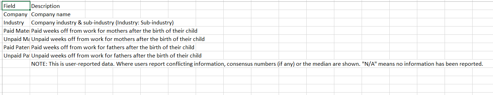

# Parental Leave Policies

Parental leave policies can have a significant impact on the well-being and career trajectories of working parents. However, access to paid parental leave varies widely across different industries and employers. To shed light on this issue, we have compiled a dataset containing information on the paid and unpaid weeks off offered by 1,601 companies as part of their maternity and paternity leave policies.

Each record in the dataset corresponds to a different company, and includes the company's name and industry as well as the number of weeks of paid and unpaid leave they offer to new parents. The data was crowdsourced from various online sources and is current as of [insert date]. This dataset can be a valuable resource for researchers, policymakers, and anyone interested in understanding the landscape of parental leave policies in different industries and companies.


## Project Flow Steps 

* <p><a href="#link1">Business Requirement Document & Data Gathering</a></p>
* <p><a href="#link2">Data Cleaning / Data Transformation</a></p>
* <p><a href="#link4">DAX</a></p>
* <p><a href="#link5">UI</a></p>
* <p><a href="#link6">Insights</a></p>

# <h2 id="link1">Business Requirement Document and Data Gathering</h2>
<br>

__Data Defination__
<br>


<br>

__Problems we are trying to Solve and our main goal/objectves__

1. Finding Top Companies who gives maximum Paid and Unpaid Maternity Leaves?.

2. Finding Top Companies who gives maximum Paid and Unpaid Paternity Leaves?.

<br>

# <h2 id="link2">Data Cleaning / Data Transformation</h2>


<br>

The column for paid and unpaid maternity and paternity leave in the dataset contains errors in data type, as they are stored as text instead of numerical values, making it difficult to interpret the data accurately. Furthermore, the presence of the value "N/A" signifies that the data is user-reported, and in cases where conflicting information is present, the median or consensus numbers are displayed. Therefore, we have replaced "N/A" with a value of zero to facilitate analysis and ensure accurate representation of the data.

<br>

# <h2 id="link4">DAX</h2> <br>

1. __Total Maternity Leave Days and Total Paternity Leave Days:__ <br>
These formulas calculate the total number of days of maternity and paternity leave offered by each company. The SUM function adds up the values of the Paid Maternity Leave, Unpaid Maternity Leave, Paid Paternity Leave, and Unpaid Paternity Leave columns for each row in the 'parental_table' table.<br>
__Formula__ 

```dax
Total Maternity Leave Days = SUM('parental'[Paid Maternity Leave]) + SUM('parental'[Unpaid Maternity Leave])
Total Paternity Leave Days = SUM('parental'[Paid Paternity Leave]) + SUM('parental'[Unpaid Paternity Leave])
```

2. __Paid and Unpaid Leave Ratio__ <br>
These formulas calculate the ratio of paid and unpaid maternity and paternity leave days offered by each company. The SUM function adds up the values of the Paid Maternity Leave, Unpaid Maternity Leave, Paid Paternity Leave, and Unpaid Paternity Leave columns for each row in the 'parental' table. The total maternity and paternity leave days are taken from the previous formulas. The result is a decimal value that represents the proportion of paid or unpaid leave days..<br>
__Formula__ 

```dax
Paid Maternity Leave Ratio = SUM('parental'[Paid Maternity Leave]) / [Total Maternity Leave Days]
Unpaid Maternity Leave Ratio = SUM('parental'[Unpaid Maternity Leave]) / [Total Maternity Leave Days]
Paid Paternity Leave Ratio = SUM('parental'[Paid Paternity Leave]) / [Total Paternity Leave Days]
Unpaid Paternity Leave Ratio = SUM('parental'[Unpaid Paternity Leave]) / [Total Paternity Leave Days]
```

3. __Industry__ <br>
These formulas calculate the average number of maternity and paternity leave days offered per industry. The AVERAGEX function calculates the average of a set of numbers (the Total Maternity Leave Days or Total Paternity Leave Days) over a table (the 'parental' table), using the unique values in the Industry column as the filter context. The result is the average number of maternity or paternity leave days per industry.<br>
__Formula__ 

```dax
Average Maternity Leave Days per Industry = 
    AVERAGEX(
        VALUES('parental'[Industry]),
        [Total Maternity Leave Days]
    )
Average Paternity Leave Days per Industry = 
    AVERAGEX(
        VALUES('parental'[Industry]),
        [Total Paternity Leave Days]
    )
```

# <h2 id="link5">Report Presentation</h2> <br>

Here's some snapshot of my dashboard : <br>

<br>
<br>
<br>

If you want to see my __Visuals and its working in detail__ . So , Kindly  visit to my __Parental_leave_policies_Dashboard.pbix__ 
<br>

# <h2 id="link6">Insights</h2> <br>

* __The majority of companies listed in the data provide 52 days of paid maternity leave.__
* __ Only a few companies provide paid paternity leave, with the highest being 35 days offered by LAC-Group and lowest  offered by Brain and Company.__
* __The industries with the most representation in the list are Technology and Insurance.__
* __ Non-profit organizations also provide paid maternity leave.__
* __ Grant Thornton offers the highest number of weeks of paid paternity leave among the listed companies, with 51 days.__
* __Only a few companies provide unpaid paternity leave, with the lowest being 12 weeks offered by several companies.__
* __Some government and nonprofit organizations also provide unpaid maternity leave.__
* __McDonald's offers the highest number of weeks of unpaid paternity leave among the listed companies, with 29 days.__

<br>

### AUTHOR
<hr>
<strong>Shehryar Gondal</strong>


You can get in touch with me on my LinkedIn Profile:<br>
 <a href = "https://linkedin.com/in/shehryar-gondal-data-analyst"></a>

You can also follow my GitHub Profile to stay updated about my latest projects:<br>
<a href = "https://github.com/ShehryarGondal1"></a>


If you liked the repo then kindly support it by giving it a star ⭐.


